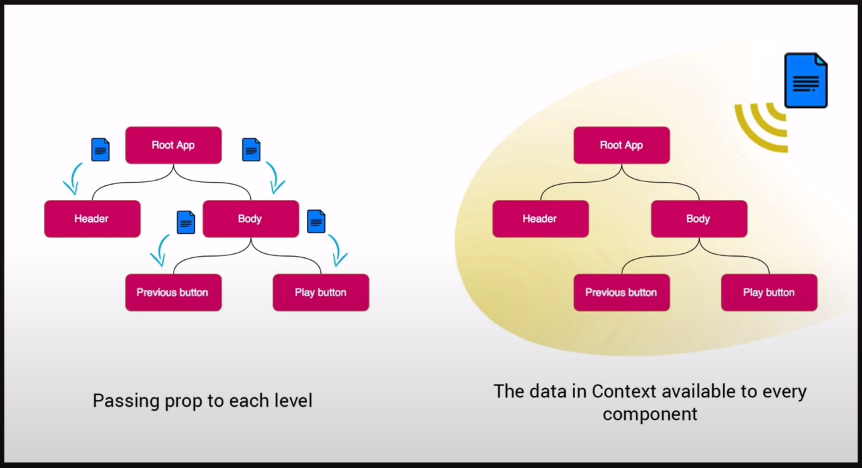

# REACT
React, web sayfalarında her documenti değiştirmek istediğimiz zaman sayfayı yeniden yüklemek yerine o 
**değişen** kısmı sadece yeniden yükler ve değiştirir. Böylece daha yüksek verim sağlanır. Kısaca bu. 
Özellikle facebook, twitter gibi anın içinde sürekli verilerin gelip gitmesi gereken tarzda uygulamalarda 
çok güçlüdür. Yani çok fazla DOM manipülasyonu yapmamız gereken uygulamarda kullanımı çok güçlüdür.
<br/>
<br/>

# Create React App
npx create-react-app my-app  
cd my-app  
npm start    
<br/>

# Dışarıdan component oluşturup kullanmak
1. Bir js dosyası oluştur
2. Bir fonksyon oluştur ve return kısmına istediğimiz htlm'i yazalım
3. Sonra export default funcName ile bunu dışa aktaralım
4. App.js dosyamıza bunu import edelim
5. Kullanmak istediğimiz yere bunu ekliyelim.(eğer içine child element giricekse <></> şeklinde yazmalıyız. girmiyecek direk kapatır şekilde yazsak yeter </>)

<br/>

# JSX ve Temel Kuralları
Javascriptin içinde javascript kodlarıylada dökümanlarımızı oluşturabiliriz AMA clean olmaz.  
JSX javascriptin içinde HTML yazmamıza olanak tanıyan yapı. Yani yazdığımız HTML'i alğılayıp  
javascripte dönüştürür.

## Temel Kurallar
1. Oluşturduğumuz componentlerin tanımlamadan tut kullanmaya kadar hep ilk harfini Büyük yaz.  
(Asıl önemli kısım import ettiğimizdeki kullanacağımız ad ama bu kuralı genel olarak uygula.)
2. Bir componentin her zaman parenti olmak zorunda.(div kullanmadan <> ve </> aralarınada yazabiliriz.  
Fragment deniyor buna. Bunu react'i import edip <>'ların arasına React.Fragment yazarakda aynı işlem   yapılabilir.)
3. Bazı javascript ifadeleri özel yapı olduğu için HTML'de kullanılan her ifade aynı şekilde yer etmez.  
Mesela "class" js için özel tanımlı yapı olduğu için "className" yazarak elementlere class verebiliriz.


### Koşullu Render İşlemi
İki yol var:  

```javascript
1.
    {isStation && <div>var</div>} 
    {!isStation && <div>var</div>}  
```  

```javascript
2.
    {friends ? <div>var</div> : <div>yok</div>}
```


# Props 
Verilerin türlerini veya varlığını istediğimiz zorunlulukta verebiliriz. Hangi verirnin hangi türde olması gerektiğini yazarak hem componenti başka kullananlara hem de ileride geri dönüp baktığımızda kendimize hatırlatma da olur.
```javascript
User.propTypes = {
    name: PropTypes.string.isRequired,
    age: PropTypes.oneOfType([PropTypes.number, PropTypes.string]).isRequired,
    friends: PropTypes.array,
    address: PropTypes.Shape({
        title: PropTypes.string,
        zip: PropTypes.Number
    })
}

User.defaultProps = {
    name: "İsimsiz",
    isLoggedIn: false,
};
```

# State 
Componentlerimiz üzerinde değerinin değişme ihtimali olan bütün verileri tutan obje kısaca.

```javascript
import {useState} from "react";

function App() {
    //adlandırma kültürü alttaki gibi, isim ve setİsim.
    const [name, setName] = useState("Mehmet)

    return (
        <div className="App">
            <h1>Mehaba {name}</h1>
            <button onClick={()=> setName("Ahmet")}> Click </button>
    )
}
```
<br/>
<br/>

### Arraye eleman eklemek: 

```javascript
<button onClick={() => setFriends([...friends, "Ayşe"])}> Add new friend </button>
//objeler içinde aynısı geçerli: {...adress, title:"Ankara"}
```

### Input İçin State Tanımı Yapmak: 

```javascript  
<input value={name} onChange={(event) => setName(event.target.value)}/>  


//Her bir input için onChange fonksyonu yazmak yerine bir fonksyonda halledelim:
const [form, setForm] = useState({name: "", surname: ""});
const onChangeInput = (e) => {
    setForm({...form, [e.target.name]: e.target.value})
}
<input name="name" value={form.name} onChange={onChangeInput}/>  
<input name="surname" value={form.surname} onChange={onChangeInput}/>
```


# Life Cycle

## useEffect
Bir component değişikliğe uğradığı anda o durumu yakalyıp bir takım işlemler yapmamızı sağlar.

```javascript
import {useState, useEffect} fromt "react";

function App() {
    const [number, setNumber] = useState(0);

    //state güncellendiğinde çalışır.
    useEffect(() => {
        console.log("State güncellendi!")
    })
    //component mount olduğunda çalışır.
    useEffect(() => {
        console.log("State güncellendi!")
    },[])
    //dizinin içine aldığı yani spesifik state yada stateler güncellendiğinde çalışır.
    useEffect(() => {
        console.log("State güncellendi!")
    },[number])

    return (
        <div>
            <h1>{number}</h1>
            <button onClick={() => setNumber(number + 1)}> Click </button>
        </div>
    )
}

export default App;
```

### Component Unmount
Bir komponenti kaldırdığımızda baglı olduğu etiketleri yok etmemiz gerekir. Yoksa arkada 
çalışmaya devam eder ve performansı kötü etkiler.  
Not: useEffect'in return değeri, componentin silindiğinde(unmount) yapılacağı işlemi yansıtır.


<br/>
<br/>
<br/>

# Routing
React router bir web sayfasında belli kısımları değiştirmek istersek tüm sayfayı baştan render 
etmek yerine sadece değişen kısmı render etmek için kullandığımız bir kütüphane.
[Bu linkten projeye eklenebilir](https://v5.reactrouter.com/web/guides/quick-start)

### Basic Routing Example
```jsx
import React from "react";
import {
  BrowserRouter as Router,
  Switch,
  Route,
  Link
} from "react-router-dom";

export default function App() {
  return (
    <Router>
      <div>
        <nav>
          <ul>
            <li>
              <Link to="/">Home</Link>
            </li>
            <li>
              <Link to="/about">About</Link>
            </li>
            <li>
              <Link to="/users">Users</Link>
            </li>
          </ul>
        </nav>

        {/* A <Switch> looks through its children <Route>s and
            renders the first one that matches the current URL. */}
        <Switch>
          <Route path="/about">
            <About />
          </Route>
          <Route path="/users">
            <Users />
          </Route>
          <Route path="/">
            <Home />
          </Route>
        </Switch>
      </div>
    </Router>
  );
}

function Home() {
  return <h2>Home</h2>;
}

function About() {
  return <h2>About</h2>;
}

function Users() {
  return <h2>Users</h2>;
}
```
### Exact Prop:
"path=`/`" yani else route'unu sona yazmadığımızda exact prop'unu verirsek  
yine aynı şekilde çalışır. Yoksa diğer about ve users route'larına bakılmaz.

<br/>
<br/>
<br/>


# YUP: Validasyon kütüphanesi
# Formik: Form Kütüphanesi

<br/>
<br/>
<br/>

# Memoization

## React.memo
Sayfada değişen stateler, proplar olduğunda return re-render yaptığı için içindeki başka componentlerde değişmediği halde re-render edilebiliyor. Performansı kötü etkiliyor. Bu durumu engellemek için o değişmeyen componentlerin exportunu şöyle yapmalıyız:

```jsx
export default React.memo(componentName);
```

## useMemo
Referans tipleri ile primitiv tipleri olayı. Primitivler hep birbirine eşitti ama reference tipleri bellekte
spesifik bir yeri tuttukları için eşit olmazlar. Bu yüzden bir component çalıştığında reference tip bir değişken aynı değeri alsada önceki değeriyle yani yeri aynı olmadığı için React.memo "===" false döndürür.
Bunu engellemek için ya o değişkeni componentin dışında tanımlarız yada içeride ihtiyacımız varsa useMemo
hook'unu kullanırız.

```jsx
import {useMemo} from "react";
//const data ={name:"mehmet"};
function App(){
    const data = useMemo(() => {
        return { name: "mehmet", number };
    }, [number]); //bu diziye atanan değer veya değerler değiştiğinde re-render yapar sadece.
}
```

## useCallback
Bir fonksyonumuz varsa ve bu fonksyonu herhangi bir alt componente geçiriyorsak ve o alt componentinde tekrar
tekrar render olmasını istemiyorsak useCallback hook'unu kullanabiliriz.

<br/>
<br/>
<br/>

# Context API
State'leri kullanmak için component'den component'e aktarmak yerine react'de default olarak gelen
context API'ı ile herhangi bir dataya herhangi bir component'de kullanabiliriz.
State yönetiminde kullanılan birden fazla araç vardır. Bunların en eskisi redux'tır.
Ama kullanımı ve öğrenimi en temizi context API'dır. Ama tabiki her işe göre kullanılan araç
değişebilir iş ve ekibe göre.
